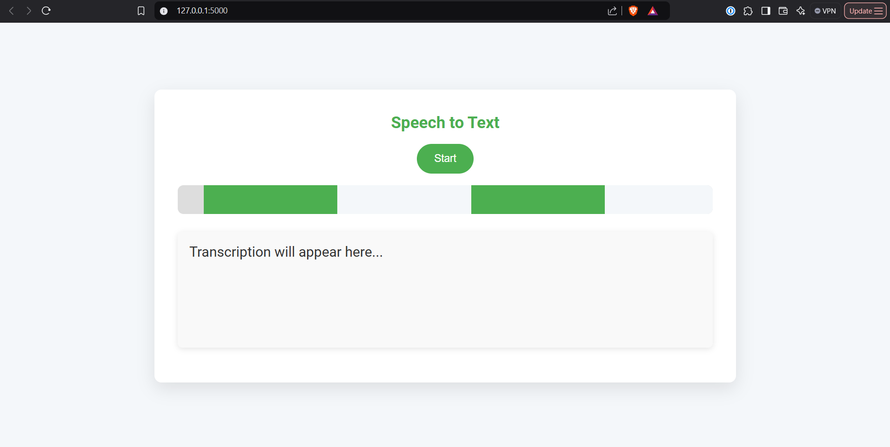

# Speech to Text Application

This project is a web application that converts speech to text using the Web Speech API and Google Speech Recognition. The transcriptions are saved locally and in Firebase Firestore.




## 1. Clone the repository

```sh
git clone <repository-url>
cd speech-to-text
```

## 2. Create a virtual environment and activate it

python -m venv venv
source venv/bin/activate  # On Windows use `venv\Scripts\activate`

## 3. Install the required packages

pip install -r requirements.txt

## 4. Set up Firebase

cred = credentials.Certificate("path/to/your/firebase/credentials.json")

## 5. Start the Flask application

python speech_to_text.py

## 6. Open your browser and navigate to

http://127.0.0.1:5000/